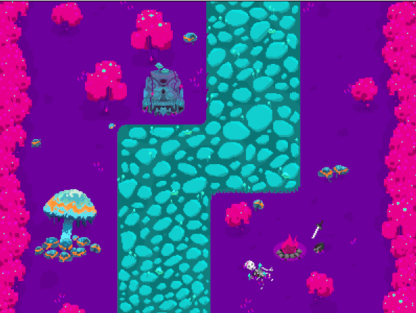
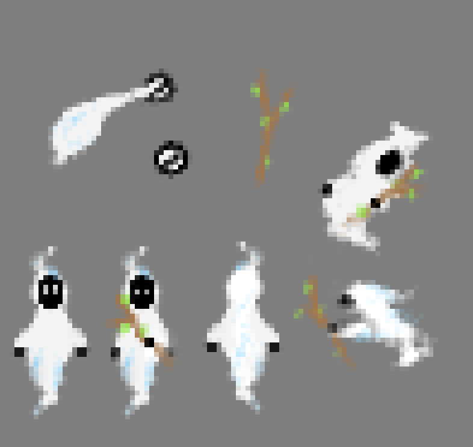
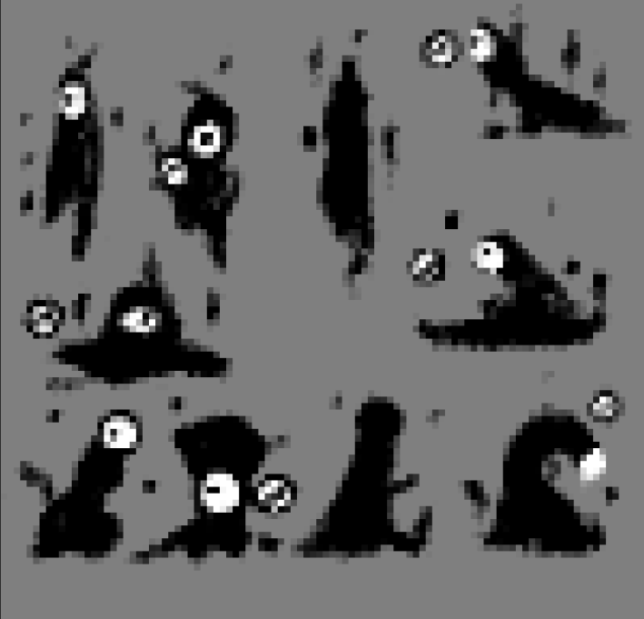
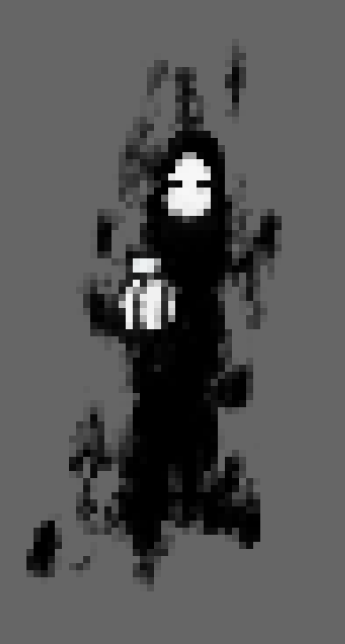

# Lights Out: Break Darkness, Bring the Light

A Java and Greenfoot action-adventure prototype set in an enchanted forest. Play as Light, a forest guardian fighting the shadows that captured the other lighteners.

## Story

Light lives in the enchanted forest with the other lighteners. The shadows, exiled for centuries because of their evil actions, return and take over the forest. Light must defeat them, rescue his friends, and bring light back to the forest.

## Current Prototype

- Move the player in four directions
- Equip and swing a sword
- Track player and enemy health
- Spawn enemies over time
- Make enemies follow and damage the player
- Use point and vector classes for movement calculations
- Display the original forest world and sprite artwork

## Controls

| Action | Key |
| --- | --- |
| Move up | `W` |
| Move left | `A` |
| Move down | `S` |
| Move right | `D` |
| Swing sword | `Space` |

## Screenshots and Concept Art

| Main character | Villains | Final boss |
| --- | --- | --- |
|  |  |  |

## Quick Start

HOW I START: HAVE GREENFOOT INSATLLED, DOUBLE CLICK GREENFOOT FILE, RUN(not full game)

1. Install [Greenfoot](https://www.greenfoot.org/download).
2. Download or clone this repository.
3. Launch the project:
   - **Windows:** double-click `open-project.bat`
   - **macOS/Linux:** run `chmod +x open-project.sh && ./open-project.sh`
4. In Greenfoot, click **Compile**, then **Run**.

You can also open `project.greenfoot` directly in Greenfoot.

## Game Design

The original concept combines thriller, action-adventure, and fantasy elements. Its influences include *The Legend of Zelda*, *The Binding of Isaac*, *Hollow Knight*, and *Dead Cells*.

The presentation envisioned a character who is always running, a roll for dodging or gaining speed, stick and sword weapons, a fast swing, a heavy piercing attack, limited health, and unlimited attempts. The repository currently contains the working movement, sword combat, enemy, health, and spawning systems described above.

## Project Structure

- `MyWorld.java` builds the game world and controls enemy spawning
- `Player.java` handles movement, health, and sword equipment
- `Enemy.java` controls pursuit, collisions, and damage
- `Sword.java` implements the animated swing and enemy hits
- `Anchor.java` contains an alternate mouse-directed weapon prototype
- `Point2D.java` and `Vector2D.java` support movement mathematics
- `images/` contains the world background, sprites, and animation frames

## Development Notes

The team worked through a limited schedule, ambitious scope, Greenfoot constraints, animation and counter glitches, and the difficulty of scaling small art assets while preserving detail and a consistent color scheme.

Possible next steps include more levels, clearer story presentation, an inventory with health potions and weapons, improved animations, rolling and dodging, and the heavy attack from the original design.

## Team

This project was created by Jonas Faes De Almeida, Kevin Nicolas Moncayo Bernal, Kiara Bartuccio, and Hélène Rousseau. Kiara contributed to the code alongside Jonas and Nico, while Hélène created the artwork.

## What I Practiced

This project strengthened my understanding of Java object-oriented design, real-time update loops, animation, collision behavior, health and damage systems, enemy spawning, and coordinating code with original game art.
